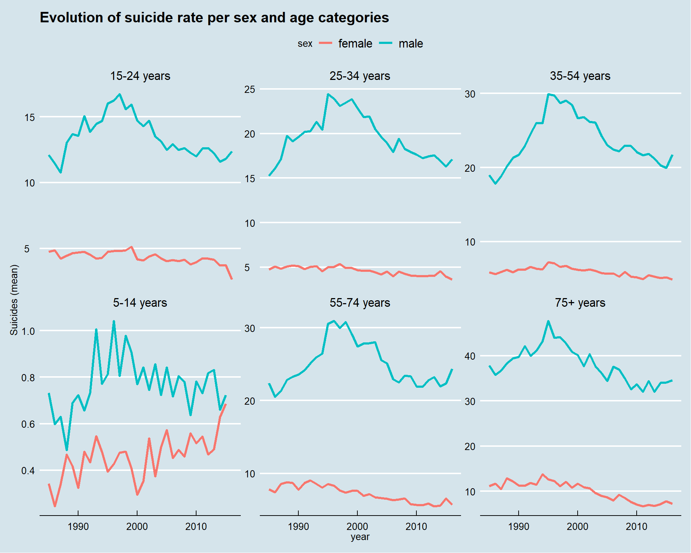

--- 
title: "Overview of suicide in the world"
author: 
- "Axel-Cleris Gailloty"
date: "2019-05-17"
site: "bookdown::bookdown_site"
output:
  bookdown::gitbook: default
documentclass: book
biblio-style: apalike
link-citations: yes
output_dir: "docs"
---

# Introduction to the project



According to the [WHO Suicides organization](https://www.who.int/news-room/fact-sheets/detail/suicide), 800.000 committed suicide in 2018. This means every 40 seconds a person dies by suicide. This number is fortunately dropping. In this kernel I want to explore the evolution of suicide rate using the dataset provided here on Kaggle.  


I'll be using the powerful R language to do this analysis, my main focus is to understand what affects the suicide rate to decrease.  

Let's start by loading the packages we'll be using throughout this study.

```{r echo=TRUE, message=FALSE, warning=FALSE, results= 'hide'}
pkg <- c("tidyverse", "FactoMineR", "factoextra", "knitr", 
         "kableExtra", "highcharter", "ggthemes", "treemap", "ggcorrplot")
pkgs <- pkg[!(pkg %in% installed.packages()[, "Package"])]
    if (length(pkgs)) 
        install.packages(pkg, dependencies = TRUE)
    sapply(pkg, library, character.only = TRUE)
```

```{r}
suicide <- read.csv("../data/master.csv")
# Fix the column name of country
colnames(suicide)[colnames(suicide) == "ï..country"] <- "country"
```
```{r}
suicide %>% head  %>% kable () %>%
  kable_styling(bootstrap_options = "striped", full_width = F)
```

## Variable definition

Before we go further in this analysis, it is important to know what each column or variable in the dataset stands for. 


I think only the columns `suicide.100k`, `suicide.no` and `HDI.for.year` are problematic. Let's explain them :  

**suicide.100k** stands for the number of death by suicide for a total 100.000 deaths.  

**suicide.no** is the number of suicide.  

**HDI.for.year** is the Human Development Index of the year.

# Data exploration  

In this section we are going to explore the data in order to find insights.

## Missing values checking and fixing

Do we have any missing data ?

```{r}
sapply(suicide, is.na) %>% colSums %>% kable () %>%
  kable_styling(bootstrap_options = "striped", full_width = F)
```

Only the `HDI.for.year` column contains missing values. What is the proportion of missing data in this column?

```{r}
sum(is.na(suicide$HDI.for.year))/length(suicide$HDI.for.year) * 100
```

Near 70 % of the data is missing for this column. We'll see how we can make use of this variable.

## Qualitative variables frequencies  

### Génération
```{r}
suicide %>% group_by(generation) %>% 
summarize(nb = n()) %>% kable () %>%
  kable_styling(bootstrap_options = "striped", full_width = F)
```

These are the number of occurences of each generation in the dataset.

```{r}
hcbar(x = suicide$generation, name = "Generation") %>% 
hc_add_theme(hc_theme_economist()) %>%
  hc_title(text = "Distribution of generations counts ")
```

X generation and silent are the most popular. Generation Z is the smallest group.  

### Age groups  

Let's now visualize the age groups


```{r}
hcbar(x = suicide$ag, name = "Age categories") %>% 
hc_add_theme(hc_theme_economist()) %>%
  hc_title(text = "Bar chart representing the counts of age category")
```

The age groups are all equally distributed. 

### By sex  

How about the the sex group. They both are equally distributed

```{r}
hcbar(x = suicide$sex, name = "Gender") %>% 
hc_add_theme(hc_theme_economist()) %>%
  hc_title(text = "Bar charts of Gender counts")
```

## Data by year  

Now do we have the same amount of data for each year ? 


```{r}
hcbar(x = as.character(suicide$year), name = "Years") %>% 
hc_add_theme(hc_theme_economist())
```

The dataset does not have all the data for each year. Each year varies. For example the last year 2016 has the fewest records. We need to keep this information in mind when we want to interpret the results of the analysis.

# Data visualization

In this section we are going to visualize the data.

```{r}
theme_set(theme_economist())
```
## Suicide rates by sex and age group

```{r fig.width=10, fig.height=8,echo=FALSE}
suicide %>% group_by(year,sex, age) %>% 
summarize(moy_suicide = mean(suicides.100k.pop)) %>% 
ggplot(aes(x= year, y= moy_suicide)) + 
geom_line(aes(color = sex), size=1.1) + facet_wrap(~age, scale = "free_y") + 
ylab("Suicides (mean)") + ggtitle("Evolution of suicide rate per sex and age categories")
```

This graphs displays a lot of information.
For all the times, all the age groups the suicide rate is higher for men than women.
This means that the variable `sex` differentiates the population of this dataset. We can check this with an analysis of variance.

## Analysis of variance (ANOVA)

```{r}
temp <- suicide %>% group_by(year,sex, age) %>% 
summarize(moy_suicide = mean(suicides.100k.pop))
fit <- aov(formula = moy_suicide~age+sex, data = temp)
summary(fit)
```

There's a statistically significant difference between the two groups (men and women). This difference is stronger than the age group. (Look at the F value, by default R doesn't print numbers < to 2e-16)

## Correlation between pairs of quantitative variables

```{r}
options(repr.plot.height = 4, repr.plot.res = 180, repr.plot.width = 6)
suicide[,sapply(suicide, is.numeric)] %>% 
cor(use = "complete.obs") %>% ggcorrplot(hc.order = TRUE, type = "lower",
   lab = TRUE) + labs(title = "Pearson's correlation of the numeric variables")
```

This graph of correlations tells us a lot of things. Let's start with the variables of economic nature such as the HDI (Human Development Index), GDP (Gross Domestic Product).  

We observe from the graph that the human development index correlates positively with the per capita GDP (0.77), which means that these two variables tend to go in the same direction. GDP correlates positively with the population. . But beware it is only a correlation and this coefficient does not translate a causality. 
For example, the number of suicide is positively correlated with the country, if we want to summarize it in a fatalistic way then it seems that the more the rich country the more the people commit suicide, which is false. The reason for this correlation is that it is a time series: the number of suicide increases with the growth of the population which itself increases with time, the same goes for the GDP, which increases every year.  

When we express the number of suicides for a population of 10,000, we can clearly see that GDP has a very weak influence.  

## Let's use the variable GDP for year (gross domestic product of the year)
A priori this variable is not in a numeric format. Considering the case of Albania in 1987, we have a GDP for men of 15-24 of 2,156,624,900. it does not mean anything because the GDP does not depend on a category of the population. This number is repeated for all age categories.

Thanks to [Google](https://www.google.com/publicdata/explore?ds=d5bncppjof8f9_&met_y=ny_gdp_mktp_cd&idim=country:ALB:MKD:MNE&hl=fr&dl=fr) we can see clearly. 

In 1987, Albania's GDP was about 2.156 billion dollars.
It is therefore concluded that this value is redundant to preserve the integrity of the tabular format of the database because a country has only one GDP while one country can be divided into several categories.

We will therefore correct this variable in order to use it in the following analysis

In order for us to be able to use this variable, we will divide the GDP by age group, so we can easily sum them up when we group the data.

```{r}
suicide$gdp <- gsub(",","",suicide$gdp_for_year....) %>% as.numeric()
gdp <- suicide %>% group_by(country, year) %>% 
summarize(occurence = n(), gdp = sum(gdp)) %>% mutate(real_gdp = gdp/occurence)
```
```{r}
france <- gdp %>% filter(country == "France")
germany <- gdp %>% filter(country == "Germany")
canada <- gdp %>% filter(country == "Canada")
```
```{r fig.width=10, fig.height=6,echo=FALSE}
highchart() %>%
    hc_add_series(name = "France", data =  france$real_gdp) %>% 
hc_add_series(name = "Germany", data =  germany$real_gdp) %>%
hc_add_series(name = "Canada", data =  canada$real_gdp) %>%
    hc_xAxis(categories = france$year) %>%
    hc_title(text = "GDP evolution") %>%
    hc_yAxis(title = list(text = "GDP (trillions"))
```

We can now use this variable for the rest of our study since we know it represents the GDP. We could verify it by multiplying the GDP per capita by the population.

Let's continue to visualize the data by creating treemaps so we can see the importance of each country according to the numerical variables of the dataset.

```{r}
gdp_2014 <- suicide %>% group_by(country, year) %>% 
summarize(occurence = n(), gdp = sum(gdp)) %>% mutate(real_gdp = gdp/occurence) %>%
filter(year == 2014)
```
```{r include=FALSE}
tm <- treemap(gdp_2014, 
              index = c('country'), 
              vSize = 'real_gdp', 
              border.col = 'darkgrey',
              border.lwds = 1,
              title = "GDP in 2013",
              draw = FALSE)
```

```{r fig.width=10, fig.height=6,echo=FALSE}
highchart() %>%
    hc_add_series_treemap(tm, layoutAlgorithm = 'squarified') %>%
    hc_title(text = 'World GDP share in 2014')
```

The US economy is really big. But China and India which also are big economies are missing in the dataset leaving Japan to be the second world highest GDP.  
Let's plot this same treemap but with GDP per capita to see how things change. 

```{r include=FALSE}
tm <- suicide %>% group_by(country, year) %>% 
summarize(occurence = n(), gdp = sum(gdp), gdp_per_capita = sum(gdp_per_capita....)) %>% 
mutate(real_gdp = gdp/occurence, gdp_capita = gdp_per_capita/occurence) %>%
filter(year == 2014) %>%
treemap(gdp_2014, 
              index = c('country'), 
              vSize = 'gdp_capita', 
              border.col = 'darkgrey',
              border.lwds = 1,
              title = "GDP capita",
       draw = F)
```
```{r fig.width=10, fig.height=6,echo=FALSE}
highchart() %>%
    hc_add_series_treemap(tm, layoutAlgorithm = 'squarified') %>%
    hc_title(text = 'GDP per capita in 2014')
```

Things have changed since Luxembourg and Norway are the countries with the highest GDP per capita.

Let's now see which are the countries with highest suicide rates that year.

```{r}
suicide_2014 <- suicide %>% group_by(country, year) %>% 
summarize( count = n(), population = sum(population), suicide_total = sum(suicides.100k.pop)) %>%
filter(year == 2014)
```

```{r include=FALSE}
tm <- treemap(suicide_2014, 
              index = c('country'), 
              vSize = 'suicide_total', 
              border.col = 'darkgrey',
              border.lwds = 1,
              title = "Suicides per 100k deaths",
              draw = FALSE)
```

```{r fig.width=10, fig.height=6,echo=FALSE}
highchart() %>%
    hc_add_series_treemap(tm, layoutAlgorithm = 'squarified') %>%
    hc_title(text = 'Suicides per 100k deaths')
```

Lithuania, South Korea and Suriname have the highest suicide rates in 2014.

# How the suicides rates have evolved ?

Now I want to compare for each available country in the dataset how the suicides rates have evolved during a long period of time.  
I learn to make the following graph thanks to this [beautiful kernel](https://www.kaggle.com/janiobachmann/price-of-avocados-pattern-recognition-analysis) of [Janio Martinez Bachmann](https://www.kaggle.com/janiobachmann). 

```{r}
mixed_df <- suicide %>% group_by(country, year, sex) %>% 
summarize(nb_occurence = n(), nb_suicide = sum(suicides.100k.pop)) %>% data.frame %>%
spread_(key_col = "year", value_col = "nb_suicide") %>% select(country, sex, "1986", "2014") %>% na.omit
```
```{r}
colnames(mixed_df) <- c("country", "sex", "yr_1986", "yr_2014")
comparison_mixed_df <- mixed_df %>% 
mutate(difference = yr_2014 - yr_1986, 
       pct = difference/yr_1986*100, 
       variation = ifelse(difference >0, "Positive", "Negative"))
```
```{r}
head(comparison_mixed_df) %>% kable () %>%
  kable_styling(bootstrap_options = "striped", full_width = F)
```

Let's now use ggplot to plot it.  

```{r fig.width=10, fig.height=12,echo=FALSE}
pl <- ggplot(comparison_mixed_df) +
  geom_segment( aes(x=country, xend=country, y=yr_1986, yend=yr_2014), color="#6E6A6A") +
  geom_point( aes(x=country, y=yr_1986), color="#F74B4B", size=3 ) +
  geom_point( aes(x=country, y=yr_2014),color="#36ACD7", size=3 ) +
  coord_flip()+ 
  theme_economist() + theme(
    legend.position = "top",
      plot.title=element_text(hjust=0.5),
      plot.background=element_rect(fill="#F4F6F7")
  ) + facet_grid(~sex, scale = "free_x") + 
labs(title="How suicides rates varies from 1986 - 2014", x="Country", 
     y="Suicides rates ",
    caption="Red: 1986, Blue: 2014")
pl
```

Let me give you a simple trick to read this plot : if the red dot is located at the right then the suicide rate dropped of the distance between the red dot and blue dot. You interpret it the same for the blue. 
The blue dot is the suicides rate in 2014, the red the suicides rate in 1986.

We see on this graphic that th suicides rates of men are twice higher than the women's (as shown in the x axis).

The women suicides rates in Singapour was really high in 1986 but it drops significantly in 28 years. In Korea we see the inverse (sadly).

# Multivariate Data Analysis

In this section let's plot all the countries in a plane so we can see how closer are countries in terms of GDP per capita, suicides rates, and population.  
We are going to do so in 1986 and 2014.

## In 1986

```{r}
pca_data <- suicide %>% group_by(country, year) %>% 
summarize(nb_occurence = n(), sum_gdp = sum(gdp), 
          population = sum(population), suicide = sum(suicides.100k.pop),
          gdp_real = sum_gdp/nb_occurence, gdp_per_capita = gdp_real/population) 
pca_1986 <- pca_data %>% filter(year == 1986) %>% select(country, population, suicide, gdp_per_capita) %>% 
data.frame(row.names = "country")
```
```{r}
library(FactoMineR)
```
```{r include=FALSE}
res_1986 <- PCA(pca_1986, scale.unit = T)
```
```{r include=FALSE}
library(factoextra)
```
```{r fig.width=10, fig.height=6,echo=FALSE}
fviz_pca_biplot(res_1986, labelsize = 4, repel = T,
               title = "PCA - Biplot 1986") + theme_economist()
```

The first dimension explains 53% of the variability among the countries. It is positively influenced by the 3 variables, but GDP per capita has a stronger influence on this first dimension.   

The second dimension explains 29% of information and is strongly influenced positively by the population and negatively by suicide.  

These two axes allow us to say that a country whose coordinates are located to the right of this graph is a rich country. Similarly a country located at the top is a populated country. 
If the country is located at the bottom of the graph the higher is the proportion of suicide in that country.  

## In 2015  

Let's see how the situation of countries has changed in 29 years

```{r fig.width=10, fig.height=6,echo=FALSE}
pca_2015 <- pca_data %>% 
filter(year == 2015) %>% select(country, population, suicide, gdp_per_capita) %>% 
data.frame(row.names = "country")
```
```{r include=FALSE}
res_2015 <- PCA(pca_2015, scale.unit = T)
```
```{r fig.width=10, fig.height=6,echo=FALSE}
fviz_pca_biplot(res_2015, labelsize = 4, repel = T,
               title = "PCA - Biplot 2015") + theme_economist()
```

Compared to the results obtained in 1986, the two dimensions have about the same importance. Suicide is not as important as it was in 1986. The direcion of arrows has changed: the more a country is on the right, the higher its suicide rate. The countries on the top right are countries with a large population and a high suicide rate. While the countries at the bottom have a small population but a very high GDP per capita.  

# Link between wealth and suicide  

Is there any link between how rich a country is and how high is the suicide rate?

```{r}
data <- suicide %>% group_by(country, year) %>% 
summarize(nb = n(), pop = sum(population), suicide_100k = sum(suicides.100k.pop),
         gdp = sum(gdp), real_gdp = gdp/nb, gdp_per_capita = real_gdp/pop) 
highchart() %>% hc_title(text = "Scatter plot of suicide rate and GDP per capita in 1986") %>%
  hc_add_series(data %>% filter(year == 1986), name = '1986', type = "scatter",
                hcaes(x = gdp_per_capita, y = suicide_100k))
```

Let's use ggplot2 to estimate a linear trend between the two variables for three periods of time.

```{r fig.width=10, fig.height=6,echo=FALSE}
pl <- data %>% filter(year %in% c(1986, 2000, 2014)) %>%
ggplot(aes(x = log10(gdp_per_capita), y = suicide_100k)) + 
geom_smooth(col = 'red', method = 'lm') +
geom_point(shape = 8, size = 0.8) + facet_wrap(~year, scale = 'free_x')
```
```{r fig.width=10, fig.height=6,echo=FALSE}
pl + 
labs(x = '\n GDP per capita (log)', y = 'Suicides per 100 k',
    title = "Link between GDP per capita and suicides rates")
```

There is a change of trend over time. In 1986 the relationship between suicide numbers and national wealth per capita seems to be positive and growing. In 2000 this same relationship becomes slightly decreasing and it seems to increase a little bit in 2014.  

The linear relationship is not clearly stated.  

To further explore this relationship, segment GDP per capita into groups to represent them in a way we can see variability among the group.

```{r}
comp <- data %>% 
mutate(intervalle = cut(gdp_per_capita, breaks = c(0,1000,5000,15000,25000, 200000),
                       labels = c("<1000", "1000-5000", "5000-15000", "15000-25000",">25000"),
                       include.lowest = FALSE))
```
```{r fig.width=10, fig.height=6,echo=FALSE}
comp %>% 
filter(year %in% c(1986, 2000, 2014)) %>% 
ggplot(aes(x = intervalle, y = suicide_100k)) + 
geom_boxplot() + facet_grid(~year) + theme(axis.text.x = element_text(angle = 90, size = 6)) +
labs(title = "Suicides 100 k \n per segment of GDP per capita",
    x = "\n Segment of GDP per capita", y = "Suicides 100 k")
```

# References

We must be careful with the interpretation for two reasons:  

*   For every year we do not have all the countries  

*   The nominal GDP per capita increases over time: for example in 1986 Albania had a per capita GDP of about 700 dollars whereas today it is  [12700](http://perspective.usherbrooke.ca/bilan/tend/ALB/fr/NY.GDP.PCAP.PP.CD.html).  

The results for 2000 are more accurate because all the countries present were able to be represented in each tranche.

Some visulization techniques inspired from the Kaggle post  
[Avocados pattern recognition analysis](https://www.kaggle.com/janiobachmann/price-of-avocados-pattern-recognition-analysis)
